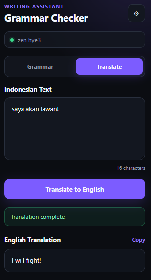

# Grammar Checker

A lightweight, framework-free Chrome extension for correcting English grammar and translating Indonesian text into English with any OpenAI-compatible Chat Completions API.


## Screenshot

<p align="center">
  
</p>

> Add more screenshots to the [`image/`](image/) directory and reference them from this section.

## Features

- Corrects English grammar while preserving the intended meaning.
- Translates Indonesian text into natural English.
- Works with OpenAI-compatible `/chat/completions` APIs.
- Supports multiple API provider configurations.
- Lets you select one provider as the active configuration.
- Tests the endpoint, API key, and model before allowing a configuration to be saved.
- Automatically normalizes API base URLs and avoids duplicating `/chat/completions`.
- Displays useful explanations for common HTTP errors.
- Detects unexpected streaming and non-JSON API responses.
- Copies generated text to the clipboard with one click.
- Automatically expands the output field to fit its content.
- Stores configurations locally using `chrome.storage.local`.
- Uses plain HTML, CSS, and JavaScript with no framework or build step.

## Requirements

- Google Chrome or another Chromium-based browser that supports Manifest V3.
- An OpenAI-compatible API endpoint.
- A valid API key and model name for that endpoint.

Examples of accepted endpoint formats:

```text
https://api.example.com/v1
https://api.example.com/v1/
https://api.example.com/v1/chat/completions
http://localhost:20128/v1
```

The extension appends `/chat/completions` when it is not already present.

## Installation

### Load the unpacked extension

1. Download or clone this repository:

   ```bash
   git clone <repository-url>
   ```

2. Open Chrome and navigate to:

   ```text
   chrome://extensions
   ```

3. Enable **Developer mode** in the upper-right corner.
4. Click **Load unpacked**.
5. Select the repository folder containing `manifest.json`.
6. Pin **Grammar Checker** from the Chrome extensions menu for easier access.

No package installation or build command is required.

## Configuration

1. Open the extension popup.
2. Click the **Settings** gear icon.
3. Click **Add configuration**.
4. Enter the provider details:
   - **Name** — a recognizable provider name.
   - **Endpoint** — the API base URL or full Chat Completions URL.
   - **API Key** — the provider's bearer token.
   - **Model** — an available model identifier.
5. Click **Check** to test the connection.
6. After a successful test, click **Save configuration**.
7. Make sure the provider is selected as the active configuration.

The connection test sends a minimal non-streaming request asking the model to reply with `OK`.

## Usage

### Grammar correction

1. Select the **Grammar** tab.
2. Enter English text.
3. Click **Check Grammar**.
4. Review the corrected result and click **Copy** if needed.

### Indonesian-to-English translation

1. Select the **Translate** tab.
2. Enter Indonesian text.
3. Click **Translate to English**.
4. Review or copy the translated result.

## API Request Format

The extension sends a request similar to:

```http
POST /v1/chat/completions
Authorization: Bearer YOUR_API_KEY
Content-Type: application/json
```

```json
{
  "model": "your-model",
  "messages": [
    {
      "role": "system",
      "content": "Task-specific system instruction"
    },
    {
      "role": "user",
      "content": "Text submitted from the popup"
    }
  ],
  "temperature": 0.2,
  "stream": false
}
```

A compatible response must include text at:

```text
choices[0].message.content
```

## Error Handling

The extension provides readable feedback for common HTTP statuses such as `400`, `401`, `403`, `404`, `429`, `500`, `502`, `503`, and `504`.

For API errors, it supports these common response shapes:

```json
{
  "error": {
    "message": "Error details"
  }
}
```

```json
{
  "message": "Error details"
}
```

Non-JSON and other raw server responses are previewed up to approximately 400 characters. Server-Sent Events (`text/event-stream`) are rejected because requests are explicitly sent with `stream: false`.

## Project Structure

```text
grammar-checker/
├── image/
│   └── app-ss.png
├── icons/
│   ├── icon16.png
│   ├── icon32.png
│   ├── icon48.png
│   └── icon128.png
├── http-errors.js
├── manifest.json
├── popup.css
├── popup.html
├── popup.js
├── settings.css
├── settings.html
├── settings.js
├── .gitignore
└── README.md
```

## Permissions

The extension requests:

- `storage` — saves API provider configurations and the selected provider locally.
- `<all_urls>` — allows requests to user-configured API endpoints, including local development servers.

Review [`manifest.json`](manifest.json) for the complete extension configuration.

## Privacy and Security

- Provider settings, including API keys, are stored locally in `chrome.storage.local`.
- Text is sent only to the API endpoint selected by the user.
- This extension does not include analytics or a separate telemetry service.
- Avoid using API keys with unnecessary permissions or unlimited spending.
- Do not commit real API keys, credentials, or private endpoint details to the repository.
- Anyone with access to your Chrome profile or local extension storage may be able to access saved settings.

## Development

The project has no dependencies and no build pipeline. Edit the source files directly, then reload the extension:

1. Open `chrome://extensions`.
2. Find **Grammar Checker**.
3. Click the reload button.
4. Reopen the popup to test the changes.

When changing `manifest.json`, reload the extension before testing.

## Troubleshooting

### Save configuration is disabled

Run **Check** and wait for a successful connection test. Saving remains disabled when the endpoint, API key, or model changes after the test.

### HTTP 401 or 403

Verify the API key and confirm that it has access to the configured model and endpoint.

### HTTP 404

Verify the base URL and model name. The extension automatically adds `/chat/completions` when needed.

### HTTP 429

The provider may have reached a rate limit or usage quota. Wait and retry, or review the provider's account limits.

### HTTP 503

The API server may be unavailable, overloaded, or under maintenance. Retry later or check the provider's service status.

### API returned a streaming response

Configure the API gateway or provider to honor `"stream": false`. Streaming responses are not supported by this extension.

## Contributing

Contributions are welcome. Fork the repository, create a focused branch, test the unpacked extension in Chrome, and submit a pull request with a clear description and screenshots for UI changes.

## License

This project is available under the [MIT License](LICENSE).
